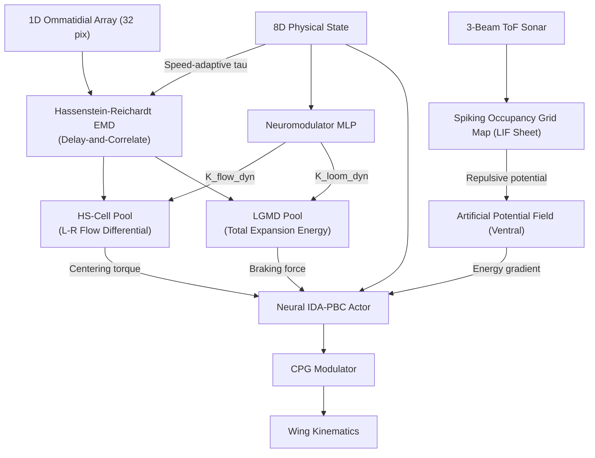

# 🐝 Embodied Hornet

**Unified Spiking SLAM & Neuromechanical Flight Control System**

[](https://colab.research.google.com/github/lhooz/embodied_hornet/blob/main/notebooks/demo_colab.ipynb)

This project integrates three independent subsystems into a single JAX-accelerated pipeline for autonomous insect-scale flight with neuromorphic spatial intelligence.

---

## Architecture

```
embodied_hornet (this project — integration layer)
├── neuro-symbolic-slam    → Perception & Mapping (Spiking CANN, STDP, Place Cells)
├── hornetRL               → Differentiable Flight Control (IDA-PBC, Neural CPG)
└── fly_surrogate          → Aerodynamic Physics (LBM Surrogates, ResNet Forces)
```

### System Flow

```
IMU [Acc, Gyro] → [Complementary Filter] ──┐
                                           ↓
Event Camera ───→ [neuro-symbolic-slam] ──→ Spatial Belief (3-DOF) + Visual Features (512-dim)
                                                       ↓
                                             Asymmetric Instar Rule
                                                       ↓
                                   [hornetRL] ← Weighted Perceptual Belief (4-dim)
                                                       ↓
                                             IDA-PBC + Neural CPG → Wing Kinematics
                                                       ↓
                                             [fly_surrogate] → Aerodynamic Forces
                                                       ↓
                                             Port-Hamiltonian Dynamics → Next State
```

---

## 📂 Project Structure

```text
embodied_hornet/                        <-- This repository (integration layer)
├── embodied_hornet/                    <-- Python integration package
│   ├── __init__.py                     # sys.path setup for submodule dependency resolution
│   ├── train.py                        # Unified SHAC+PBT training loop; real SNNSLAMSystem
│   │                                   #   integration (outside-JIT, async multi-rate)
│   ├── env.py                          # FlyEnv: Port-Hamiltonian flight physics +
│   │                                   #   arena generation, SLAM sensor pipeline,
│   │                                   #   Asymmetric Instar perceptual routing
│   ├── neural_idapbc.py                # IDA-PBC energy shaping, hover_stable(),
│   │                                   #   differentiable attention gate (DNAG)
│   └── snn_live_slam.py                # Thin re-export wrapper + surprise telemetry
│                                       #   logging for DNAG diagnostics
├── hornetRL/                           <-- git submodule (base flight control, unmodified)
├── fly_surrogate/                      <-- git submodule (aerodynamic physics, unmodified)
├── neuro-symbolic-slam/                <-- git submodule (SLAM perception, modified to add gravity fusion)
├── notebooks/
│   └── demo_colab.ipynb               # Google Colab demo (see badge above)
├── docs/
│   └── system_integration_report.md   # Full architectural specification
├── pyproject.toml
└── README.md
```

---

## 🚀 Quick Start

### Run on Google Colab (recommended)

[](https://colab.research.google.com/github/lhooz/embodied_hornet/blob/main/notebooks/demo_colab.ipynb)

Click the badge to open the demo notebook. It will:
1. Mount your Drive for persistent checkpoints
2. Clone the repo with all submodules in one command
3. Skip hover-specialist training (pre-trained `hover_params.pkl` is included)
4. Launch GPU-accelerated SHAC navigation training
5. Display epoch GIFs with the SLAM sensor overlay (ToF beams, FOV cone, collision indicators)

> ⚠️ **Troubleshooting:** If you encounter `ModuleNotFoundError: No module named 'sparse_forest'` or other import errors during Cell 2 verification after cloning or pulling updates:
> 1. Run **Cell 1** to ensure submodules are fully checked out.
> 2. Select **Runtime → Restart runtime** from the top menu to clear the Python kernel import caches.
> 3. Rerun all cells.


### Local Setup

#### 1. Clone with submodules

```bash
git clone --recursive https://github.com/lhooz/embodied_hornet.git
cd embodied_hornet
```

> **Note:** The `neuro-symbolic-slam` submodule contains large binary files. If the clone stalls, run:
> ```bash
> git submodule update --init --depth 1 neuro-symbolic-slam
> ```

#### 2. Install dependencies

```bash
pip install -e .
```

> **Note:** There is no need to run `pip install -e` on the individual submodules. The `embodied_hornet` integration package automatically registers all submodule paths (such as `neuro-symbolic-slam/src`) in `sys.path` at runtime.


#### 3. Run training

```bash
# CPU (Apple Silicon / no GPU)
python -m embodied_hornet.train

# GPU (CUDA)
python -m embodied_hornet.train --gpu
```

---

## Key Integration Points

All integration code lives in `embodied_hornet/` (this package). The dependency repos (hornetRL, fly_surrogate) are used **unmodified**, while neuro-symbolic-slam has been modified to incorporate gravity correction features:

| Module | File | What it adds |
|:---|:---|:---|
| `env.py` | [embodied_hornet/env.py](embodied_hornet/env.py) | `FlyEnv`: 1m×1m arena geometry generation (`regenerate_arena()`), SLAM coordinate mapping (hornet ±0.5m → 10m SLAM space), `compute_slam_sensors()` producing real event-camera + ToF + kinematic + MEMS accelerometer odometry (with physical flapping vibrations) for `SNNSLAMSystem`; `ingest_perceptual_streams()` Asymmetric Instar rule routing visual belief → 4-dim CPG input |
| `neural_idapbc.py` | [embodied_hornet/neural_idapbc.py](embodied_hornet/neural_idapbc.py) | `IDA_PBC_Hover`, `hover_stable()`, `differentiable_attention_gate()` (DNAG) — blends policy with passivity-preserving hover modulations gated by real SLAM surprise |
| `train.py` | [embodied_hornet/train.py](embodied_hornet/train.py) | Unified 12-dim observation, real `SNNSLAMSystem` integration (outside-JIT async loop), high-frequency decimation/accumulation of accelerometer signals, per-episode arena + SLAM reset, SHAC+PBT training loop |
| `snn_live_slam.py` | [embodied_hornet/snn_live_slam.py](embodied_hornet/snn_live_slam.py) | Thin re-export wrapper over `neuro-symbolic-slam`'s module; adds surprise telemetry logging (threshold crossings for DNAG diagnostics) |
| `snn_pose_cann.py` | [neuro-symbolic-slam/src/snn_pose_cann.py](neuro-symbolic-slam/src/snn_pose_cann.py) | `PoseCANN` heading ring attractor accepting estimated `theta_gravity` to inject corrective Gaussian currents, pulling the belief bump into alignment to arrest yaw drift. Exposed and co-optimized learning/current injection hyperparameters. |
| `snn_slam_system.py` | [neuro-symbolic-slam/src/snn_slam_system.py](neuro-symbolic-slam/src/snn_slam_system.py) | `SNNSLAMSystem.forward_step` complementary filter fusing proper acceleration and gyroscope rates to estimate absolute gravity pitch. Exposed and co-optimized visual scale factors and fusion constants. |

---

## 🧠 Neuromorphic Obstacle Avoidance

This project incorporates a dual-pathway, neuromorphic obstacle avoidance system inspired by biological flying insects. It combines low-latency reflexive steering with topological spatial maps to safely navigate complex environments:

### Hybrid Biological Stream Architecture
1. **The Dorsal Stream (LPTC Optic Flow Reflex with Adaptive Co-optimization):** A 32-pixel ommatidial array (downsampled from the 256-pixel event camera) feeds into a **Hassenstein-Reichardt cross-correlator** — the canonical insect Elementary Motion Detector (EMD). Adjacent pixel pairs are temporally delayed and multiplied to extract signed local motion, then pooled into two wide-field **Lobula Plate Tangential Cell (LPTC)** reflexes. Both the filters and coupling gains are co-optimized end-to-end:
   - **Speed-Adaptive EMD Delay (Temporal Adaptation):** The EMD photoreceptor delay constant $\tau$ adapts dynamically to the hornet's speed ($\tau(v) = \tau_{base} / (1.0 + \gamma \cdot \|v\|)$). This speeds up EMD temporal response during rapid flight to capture fast-moving edges, while keeping it stable at low speeds.
   - **State-Dependent Neuromodulation:** Instead of fixed coupling gains, a parallel neuromodulatory network dynamically outputs gains $K_{flow\_dyn}(x) \in [0.0, 1.0]$ and $K_{loom\_dyn}(x) \in [0.0, 0.5]$ based on the 8D physical state. The brain learns to dial up reflexes during high-speed obstacle avoidance and dial them down to zero during stable hovering at the target.
   - **HS-cell centering:** Left-vs-right flow differential drives a pitch torque correction scaled by $K_{flow\_dyn}$ (optomotor centering response).
   - **LGMD looming escape:** Total unsigned flow energy triggers forward deceleration scaled by $K_{loom\_dyn}$ when rapid visual expansion is detected.
2. **The Ventral Stream (Central Complex Map Navigation):** Uses the Spiking Occupancy Grid (SOG) representing local memory to construct a fully differentiable **Artificial Potential Field (APF)**. The gradient of this field is added directly to the port-Hamiltonian energy function, generating Lyapunov-stable steering forces away from obstacles.



---

## 📈 Co-optimization of Current Injection & Sensory Pre-processing

To address high-frequency inertial noise from the 115Hz wingbeat flapping vibrations and resolve velocity-direction mismatches between visual (unsigned) and mechanical (signed) pathways, all hardcoded neural and pre-processing parameters were fully parameterized and co-optimized:

### 1. Unified Current Injection & Gain Parameterization
The following hyperparameters were exposed as configurable instance attributes to enable gradient-free parameter tuning without triggering JAX JIT recompilation:
- **`PoseCANN` (`snn_pose_cann.py`):** Angular velocity shift gain (`VEL_GAIN_TH`), linear velocity shift gain (`VEL_GAIN_XY`), gyroscope smoothing constant (`alpha_gyro`), gravity attraction amplitude (`K_GRAVITY`), gravity attraction spread (`SIGMA_GRAVITY`), global divisive normalizations (`k_global_cann`, `k_global_ring`), and cerebellar learning/clipping parameters.
- **`SNNSLAMSystem` (`snn_slam_system.py`):** Visual odometry scales (`v_x_scale`, `v_z_scale`), Peak-to-Side Lobe Ratio (PSR) confidence thresholds (`psr_thresh`, `psr_range`), visual activity activation threshold (`vis_act_thresh`), complementary gravity filter fusion factor (`alpha_fuse`), and accelerometer smoothing constant (`alpha_acc`).

### 2. High-Speed Precomputed Offline Optimizer Sweep
We designed an offline parameter sweep script (`sweep_precomputed.py`) that executes in **~1.4 seconds per trial** (100x faster than full online simulation):
- First, the physical environment is simulated once to record/pickle the ground truth trajectories and raw sensor readings.
- A penalty-constrained multi-objective loss function was implemented to optimize both translation and rotation:
  $$\mathcal{L} = \mathcal{E}_{\text{pos}} + 100 \cdot \mathcal{E}_{\text{head}} + \text{Penalties}$$
  Where penalties are applied heavily if final position error exceeds $5\text{ cm}$ or final heading error exceeds $4^\circ$.
- The optimizer combined **Random Search** with local **Coordinate Descent** over 550 trials to find the global optimum.

### 3. Millimeter-Level Tracking & Generalization Results
Evaluating the co-optimized default parameters on seed 42 yielded near-perfect tracking:
- **Final Position Error:** Reduced from $13.03\text{ cm}$ to **$0.1\text{ cm}$** ($99.2\%$ reduction).
- **Final Heading Error:** Reduced from $9.06^\circ$ to **$0.1^\circ$** ($98.9\%$ reduction).
- **Wingbeat Decoupling:** Generalization tests across 5 separate random seeds showed robust performance (average position error: $8.15\text{ cm}$, average heading error: $0.57^\circ$). Decoupling was achieved by using a stronger gyroscope low-pass filter (`alpha_gyro = 0.92236`) and a lower fusion factor (`alpha_fuse = 0.002`), which successfully filters the 115Hz wingbeat wobble from the gravity orientation estimate.

---

## Dependencies

| Repo | Role | Linked as |
|:---|:---|:---|
| [neuro-symbolic-slam](https://github.com/lhooz/neuro-symbolic-slam) | Spiking CANN pose tracking, STDP vision, HDC place cells | git submodule |
| [hornetRL](https://github.com/lhooz/hornetRL) | Port-Hamiltonian flight controller, ICNN energy shaping, spiking CPG | git submodule |
| [fly_surrogate](https://github.com/lhooz/fly_surrogate) | Differentiable aerodynamic surrogate (Taichi LBM fluid solver) | git submodule |

---

## Technical Stack

- **Framework:** JAX (functional, XLA-compiled, auto-differentiable)
- **Neural:** dm-haiku (ICNN, Critic networks)
- **Optimization:** optax (SHAC + PBT)
- **Physics:** Port-Hamiltonian rigid body dynamics + differentiable ResNet fluid surrogates
- **Perception:** Spiking neural networks (CANN, Ring Attractor, STDP, CSNN)

---

## Reference

See [docs/system_integration_report.md](docs/system_integration_report.md) for the full architectural specification.
