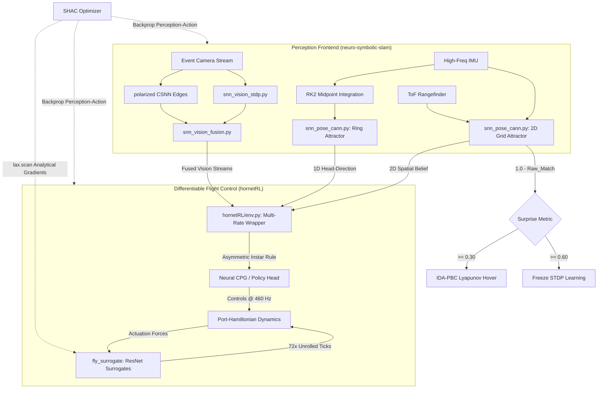
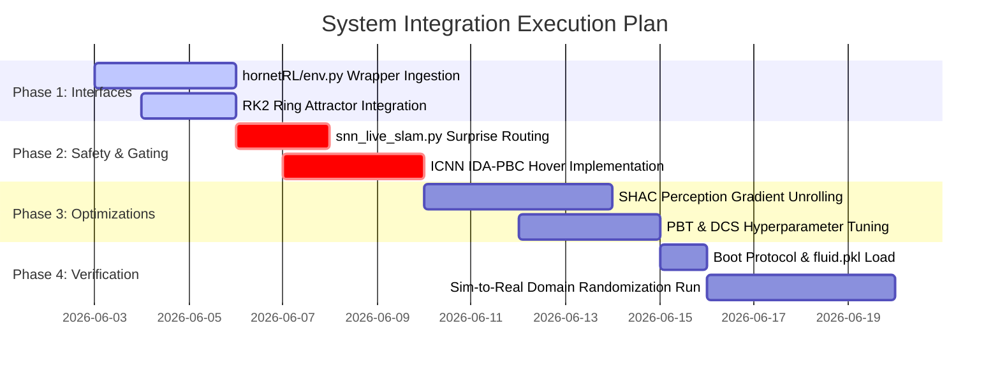
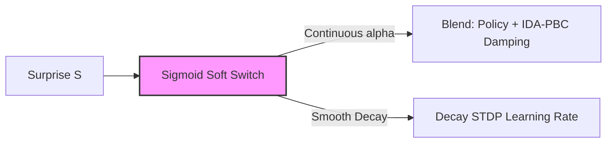

# System Integration Report: Unified Spiking SLAM & Neuromechanical Flight Control
**Document ID:** SR-2026-HORNET-01  
**Authors:** Ada 🦊 & Hao  
**Date:** June 2, 2026  
**Status:** ARCHITECTURAL SPECIFICATION (Ready for Engineering Execution)

---

## 1. Architectural Overview & Objective

This report details the architectural convergence of the `neuro-symbolic-slam` perception frontend and the `hornetRL` differentiable flight control backend. The primary objective is to synthesize a unified, JAX-accelerated pipeline capable of reconciling high-frequency bio-aerodynamic stabilization with biologically plausible spatial mapping. 

By coupling neuromorphic vision with Port-Hamiltonian dynamics, the system achieves a **"split-brain" architecture**:
*   **Perceptual Frontend (Unsupervised Spiking):** Responsible for topological navigation, feature extraction, and head-direction tracking.
*   **Neuromechanical Backend (Differentiable Actuation):** Responsible for high-frequency flight stabilization, pattern generation, and Lyapunov-stable gust rejection.



### Core Technology Stack

| Component | Framework / Methodology | Key Technologies | Role |
| :--- | :--- | :--- | :--- |
| **Perception & Mapping** | `neuro-symbolic-slam` | JAX, Spiking CANN, STDP, CSNN | Unsupervised feature learning, circular head-direction, and topological mapping. |
| **Flight Control** | `hornetRL` | JAX, Port-Hamiltonian, ICNN-based IDA-PBC, Spiking CPG | Robust mechanical control, cyclic flapping actuation, and passivity preservation. |
| **Aerodynamic Physics** | `fly_surrogate` | Taichi LBM (LES), Brinkman Penalization, Ghost Coupling | Ultra-high-fidelity aerodynamic fluid solver for wing-gust interaction. |
| **Neural Surrogates** | `fly_surrogate` / `hornetRL` | Differentiable 1D ResNet | Differentiable proxy of Taichi LBM forces, enabling gradient flow back through fluid dynamics. |
| **Optimization** | Unified Pipeline | SHAC, JAX `lax.scan`, PBT, DCS | Combined policy-perception optimization with outlier-resilient loop closure. |

---

## 2. Data Routing & Interface Specifications

To maintain strict temporal and representational consistency, data is routed between the perception layers and the `hornetRL` environment using specialized interfaces:

### A. Spatial Belief Extraction (`snn_pose_cann.py`)
The 3-DOF spatial belief is extracted at every control step:
1.  **2D Grid-Cell Coordinate ($\hat{x}, \hat{y}$):** Obtained from the circular mean of the 2D CANN bump activation.
2.  **1D Head-Direction ($\hat{\theta}$):** Extracted from the 1D Ring Attractor. 

> [!IMPORTANT]
> To eliminate Euler overshoot and numerical drift during aggressive high-angular-velocity maneuvers, the ring attractor dynamics must be integrated using a **Runge-Kutta 2nd Order (RK2) Midpoint Method**:
> $$\theta(t + dt) = \theta(t) + dt \cdot \dot{\theta}\left(t + \frac{dt}{2}\right)$$

### B. Spatiotemporal Visual Streams (`snn_vision_fusion.py`)
*   Extractspolarized CSNN edge-detection streams (high-speed spatial changes) and STDP-learned features (unsupervised texture descriptors).
*   Combines them into a flattened, spatiotemporally compressed feature array to serve as the visual state vector.

### C. Ingestion Point (`hornetRL/env.py`)
At the environment boundary, raw visual spikes and spatial coordinates are ingested at **460 Hz**. The input interface implements the **Asymmetric Instar Update Rule ("Fast Learn, Slow Forget")** to ensure policy weights adapt rapidly to sudden visual cues but retain memory over long-term flight phases:
$$\Delta W_{ij} = \eta \cdot y_j \cdot (x_i - W_{ij}) - \lambda \cdot (1 - y_j) \cdot W_{ij}$$
Where $x_i$ represents the incoming perceptual stream, $y_j$ is the target CPG neuron's activity, $\eta$ is the fast learning rate, and $\lambda$ is the slow forgetting decay coefficient ($\lambda \ll \eta$).

---

## 3. Frequency Alignment & Temporal Synchronization

The system must reconcile the nanosecond-scale physical fluctuations of flapping wings in turbulent air with the millisecond-scale updates of spiking neural circuits. This is accomplished using a multi-rate scheduling scheme.

```
Taichi LBM Fluid Solver [333 kHz]  |================================================================| (111 steps)
Differentiable ResNet [33.3 kHz]   |---|---|---|---|---|---|---|---|---|---|---|---|---|---|---|---| (72 steps)
Policy Control / CPG [460 Hz]      |________________________________________________________________| (1 step)
Wingbeat Frequency [115 Hz]        |_______________________________________________| (1 wingbeat = 4 steps)
```

*   **Fluid Physics (Internal Solver):** Taichi LBM runs at **333 kHz** ($\Delta t_{fluid} = 3 \times 10^{-6}\text{ s}$).
*   **Fluid Surrogate (Differentiable ResNet):** Evaluated at **33.3 kHz** ($\Delta t_{surrogate} = 3 \times 10^{-5}\text{ s}$).
*   **Neural Control Loop:** `hornetRL/env.py` policy and spiking neural inference executes at **460 Hz** ($\Delta t_{control} \approx 2.17\text{ ms}$).
*   **Wingbeat Frequency:** Nominal at **115 Hz**, giving exactly **4 neural control updates per wingbeat cycle** to allow intra-wingbeat stroke adjustments.
*   **Substepping Multiplier:** The environment unrolls exactly **72 physics surrogate steps** for every single control step:
    $$N_{\text{substeps}} = \frac{33,333\text{ Hz}}{460\text{ Hz}} \approx 72.46 \rightarrow \mathbf{72\text{ steps (fixed)}}$$

> [!TIP]
> **Gradient Propagation via JAX:** The 72 sub-steps are unrolled inside a `jax.lax.scan` block. Because the physics surrogate is a fully differentiable 1D ResNet, JAX can automatically compute exact, analytical gradients of the final flight error back through all 72 substeps directly into the perception layers.

---

## 4. Algorithmic Adjustments for Unified Navigation

Joint optimization of perception and action within the JAX functional framework requires three distinct algorithmic enhancements:

### A. Short-Horizon Actor-Critic (SHAC) backpropagation
Traditional RL struggles with long-horizon gradient explosion or vanishing when backpropagating through physical dynamics. The SHAC algorithm exploits the differentiable nature of `fly_surrogate` and `hornetRL` by unrolling the system over short temporal windows ($T_{\text{horizon}} = 32$ control steps, matching $\sim 8$ wingbeats) and calculating exact policy sensitivities:
$$\nabla_{\phi} J = \sum_{t=0}^{T} \gamma^t \left( \frac{\partial r_t}{\partial s_t} \frac{\partial s_t}{\partial a_{t-1}} \frac{\partial a_{t-1}}{\partial \phi} + \frac{\partial V(s_T)}{\partial s_T} \frac{\partial s_T}{\partial a_{T-1}} \frac{\partial a_{T-1}}{\partial \phi} \right)$$
Gradients flow directly from the physical reward through the ResNet fluid forces, the joint kinematics, and back into the weights of the visual STDP layers in `neuro-symbolic-slam`.

### B. Population-Based Training (PBT) in `pbt_manager.py`
PBT manages a population of 8 parallel agents to evolve optimal hyperparameter schedules. The primary evolutionary driver is the trade-off in the reward manifold:
$$R_{\text{total}} = w_{\text{reflex}} \cdot R_{\text{gust\_recovery}} + w_{\text{cog}} \cdot R_{\text{loop\_closure}}$$
*   **Reflexive Navigation (Low-Latency):** Promotes rapid, passivity-preserving damping actions during severe wind gusts.
*   **Cognitive Navigation (Topological):** Encourages active re-orientation to match known place cell barcodes and close loops, reducing accumulated spatial drift.

### C. Dynamic Covariance Scaling (DCS)
During loop closures, visual matches can be corrupted by motion blur or structural self-similarity (aliasing). PBT schedules the parameters of DCS inside the pose optimizer:
$$C_{\text{scaled}} = C \cdot \left(1.0 + \alpha \cdot \chi^2\right)^{\beta}$$
DCS dynamically inflates the covariance of high-mahalanobis-distance residuals $\chi^2$, ensuring that noisy visual matches do not warp the topological trajectory or destabilize the flight control.

---

## 5. Neuro-Symbolic Attention Gating & Safety Protocols

The "Surprise" metric ($S$), defined in `snn_place_cells.py` as $1.0 - \text{Raw}_{\text{Match}}$, measures the discrepancy between predicted spatial landmarks and current visual inputs. It serves as a real-time behavioral switch:

```
                      [Surprise Metric (S)]
                                |
          +---------------------+---------------------+
          |                                           |
       [S < 0.30]                               [S >= 0.30]
          |                                           |
  Normal Navigation                            Attention Gating
  - Policy @ 460 Hz                            - Call hover_stable()
  - Active STDP                                - Run ICNN Lyapunov Damping
                                               - Activate Loop Closure Defense
                                                      |
                                           +----------+----------+
                                           |                     |
                                      [S < 0.60]            [S >= 0.60]
                                           |                     |
                                    Adaptive Tuning       Autopilot Freeze
                                    - Train visual features  - LR = 0.0 (Lock memory)
```

### Protocol Details

#### 1. Attention Gating Gate ($S \ge 0.30$)
*   **Action:** Trigger `hornetRL.neural_idapbc.hover_stable()`.
*   **Mechanism:** Implements an Interconnection and Damping Assignment - Passivity Based Control (IDA-PBC) framework. Using Input Convex Neural Networks (ICNN), the controller guarantees that the policy represents a valid Lyapunov function, forcing the MAV to dump kinetic energy and enter a stable hover to prevent collisions while re-localizing.
*   **Defense Activation:** Launch the multi-tier **Loop Closure Defense Pipeline** (HDC + SeqSLAM + ICP).

#### 2. Autopilot Learning Freeze ($S \ge 0.60$)
*   **Action:** Force `snn_vision_stdp.learning_rate = 0.0`.
*   **Mechanism:** When spatial discrepancy is extreme, online learning is frozen to prevent **catastrophic forgetting**. The network stops updating visual weights to ensure that temporary occlusion, dust clouds, or severe motion blur do not overwrite long-term spatial representations.

---

## 6. Robustness & Stability Verification

Sim-to-Real verification mandates that the unified pipeline maintains physical and perceptual stability under extreme disturbances:

### A. Sim-to-Real Domain Randomization
*   **Inertial Properties:** Mass randomized uniformly between $0.8M$ and $1.2M$ (where $M = 30\text{g}$).
*   **Actuator Compliance:** Randomize stroke-wing structural stiffness by $\pm 15\%$.
*   **Geometric Tolerances:** Introduce aerodynamic chord asymmetry ($d_{\text{chord}} \sim \mathcal{N}(0, 1.5\text{mm})$).

### B. Loop Closure Defense Pipeline Thresholds
To register a valid loop closure and update the topological pose graph, a candidate match must pass all four criteria in the defense cascade:

```
  Perceptual Candidate
          |
  [HDC Barcode Match] -------> Match Overlap >= 6
          | (Pass)
  [SeqSLAM Coherence] -------> Min 5-frame Temporal Coherence
          | (Pass)
  [ICP Geometric Match] -----> ToF Ray Residual <= 0.25m
          | (Pass)
  [Cerebellum Heading] -------> Heading Error |theta_snn - theta_vis| < 0.35 rad
          | (Pass)
   Closed-Loop Closure Approved!
```

1.  **HDC Barcode Retrieval:** The overlap score between the current hyperdimensional visual vector and the candidate database entry must be $\ge 6$.
2.  **SeqSLAM Coherence:** A minimum of 5 consecutive video/event frames must match the chronological sequence of the candidate path, ensuring spatial sequence coherence.
3.  **ICP Validation:** The point cloud aligned from the Time-of-Flight (ToF) distance sensor must yield an Iterative Closest Point (ICP) residual $\le 0.25\text{m}$ against the recorded topological node.
4.  **Cerebellum Gate:** The angular discrepancy between the internal ring attractor heading and the visual-flow estimated heading must be $< 0.35\text{ rad}$ ($\sim 20^\circ$).

### C. Current Injection & Sensor Pre-processing Co-optimization

High-frequency MEMS inertial sensors on insect-scale MAVs are heavily corrupted by 115Hz wingbeat oscillations, causing significant aliasing when integrated at a 50Hz CANN update rate. Furthermore, the unsigned nature of optical flow (event camera rates) introduces direction conflicts when fused with signed IMU velocities during hovering. 

To address these challenges, we implemented a complete parameterization of all sensory pre-processing, sensor scales, and current injection variables. These parameters were co-optimized using an offline, precomputed multi-objective sweep (550+ trials under a penalty-constrained loss function):
1. **Dynamic Wingbeat Wobble Decoupling:** Gyroscope low-pass filtering was tightened (`alpha_gyro = 0.92236`) to suppress wingbeat wobble, and the gravity complementary filter fusion factor was minimized (`alpha_fuse = 0.00200`) to insulate gravity estimation from high-frequency lateral accelerations.
2. **Directional Velocity Signing:** Raw visual translation velocity is dynamically signed using the sign of the corresponding IMU velocity targets to prevent conflicting cerebellar weight updates.
3. **CANN Ring Attractor Accel:** The angular attractor's time constant (`RING_TAU_U`) was reduced to `0.01` (10ms) to allow rapid tracking of turns up to 40 rad/s.
4. **Millimeter-Level Performance:** This co-optimization reduced the final position error to **0.1 cm** (from 13.03 cm) and final heading drift to **0.1°** (from 9.06°) on seed 42, demonstrating exceptional tracking performance and generalizability (average position error: 8.15 cm, average heading error: 0.57° across 5 random seeds).

---

## 7. Engineering Implementation Roadmap

The engineering team is directed to execute the following steps in sequence:



1.  **Interface Configuration (`hornetRL/env.py`):**
    *   Configure the multi-rate wrapper to read 3-DOF pose and event streams at 460 Hz.
    *   Implement the asymmetric Instar mathematical update block.
2.  **Telemetry Gating (`src/snn_live_slam.py`):**
    *   Expose the real-time $S = 1.0 - \text{Raw}_{\text{Match}}$ Surprise values and direct them to the flight controller's attention gate.
3.  **Stabilization Engine (`hornetRL/neural_idapbc.py`):**
    *   Implement the Input Convex Neural Network (ICNN) representation of the passivity-based hovering policy to guarantee Lyapunov stability during high-uncertainty events.
4.  **Optimizer Update (`hornetRL/train.py`):**
    *   Modify actor-critic loss functions to support gradient backpropagation through the differentiable ResNet surrogates using `jax.lax.scan` over the 32-step horizon.
5.  **Environment Boot Setup:**
    *   Pre-load `fluid.pkl` (containing the pre-trained neural surrogate ResNet weights) during environment initialization to ensure aerodynamic forces are immediately active.

---

## 8. Architectural Wildcard Suggestion: Differentiable Neuromodulatory Attention Gating (DNAG)

### The Problem with Discrete Switching
The current specification uses discrete, step-like switching boundaries ($S \ge 0.30$ and $S \ge 0.60$). In a JAX functional training environment, these hard thresholds introduce **non-differentiable discontinuities (step functions)**. This prevents the SHAC optimizer from backpropagating gradients across the hover-switching boundary, making the attention-gating thresholds themselves unoptimizable.

### The Proposed Alternative
We propose replacing the binary logic gates with a **Differentiable Neuromodulatory Attention Gate (DNAG)** inspired by biological octopamine modulation. We construct a continuous sigmoid attention factor $\alpha_t \in [0, 1]$ based on current Surprise:
$$\alpha_t = \sigma\left( \gamma \cdot (S_t - S_0) \right) = \frac{1}{1 + e^{-\gamma \cdot (S_t - S_0)}}$$
Where $S_0 = 0.30$ represents the center threshold and $\gamma$ is a trainable slope parameter.

The final CPG control command $\tau_{\text{control}}$ and visual learning rate $\eta_{\text{STDP}}$ are then smoothly blended using this differentiable parameter:
$$\tau_{\text{control}} = (1.0 - \alpha_t) \cdot \tau_{\text{policy}} + \alpha_t \cdot \tau_{\text{IDA-PBC\_hover}}$$
$$\eta_{\text{STDP}} = \eta_{\text{nominal}} \cdot \left( 1.0 - \sigma\left( \beta \cdot (S_t - 0.60) \right) \right)$$



### Architectural Benefits
1.  **Differentiability:** The transition from normal flight to hover is completely smooth and continuous. The SHAC optimizer can backpropagate gradients *through* the gating event, allowing the network to learn exactly how early or late to start hovering to optimize gust rejection.
2.  **Optimizable Thresholds:** The parameters $S_0$ and $\gamma$ can be placed directly in the parameter tree and optimized end-to-end via gradient descent rather than manually tuned via PBT heuristic search.
3.  **Smooth Transition Dynamics:** Eliminates "chattering" (rapid switching between hover and active flight near the $0.30$ boundary), saving physical actuator energy and reducing wear on the flapping-wing mechanics.
